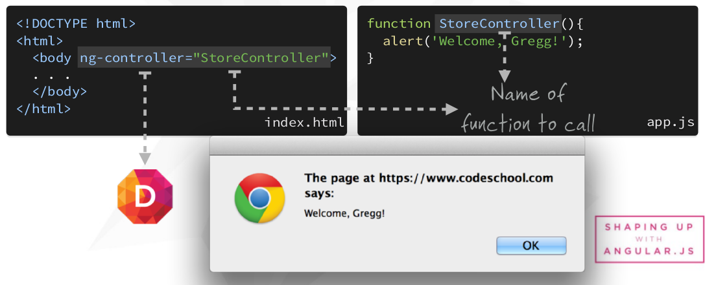
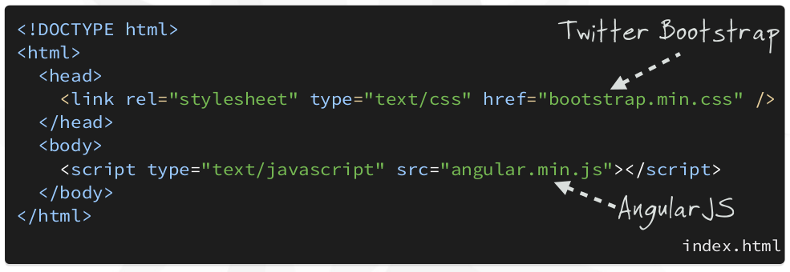
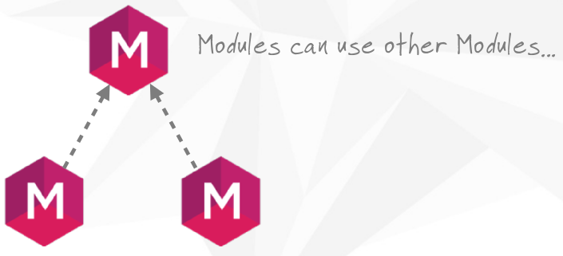
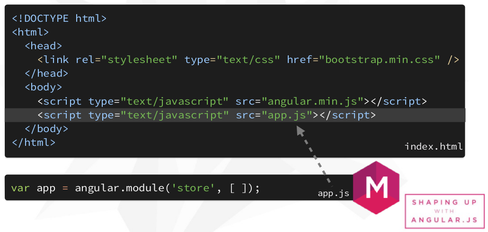

#Qué es AngularJS?
Es un framework javascript del lado del cliente que nos permite agregar interactividad al HTML

**Cómo llamarías al HTML cuando lanzas el javscript?**  
A través de Directivas

##Directivas
Una Directiva es un marcador en una etiqueta HMLT, que llama a Angular para correr o referenciar algun código JavaScript.  

##Empezando
Incluir el [css de bootstrap](http://getbootstrap.com/) y la [http://getbootstrap.com/](https://angularjs.org/)

##Módulos
- Donde escribimos las piezas de nuestras aplicación angular.
- Hace que nuestro sea más mantenible, testeable y legible.
- Donde definimos las dependencias de nuestras aplicación.

**Creando nuestro primer módulo**

**Incluyendo nuestro módulo**

